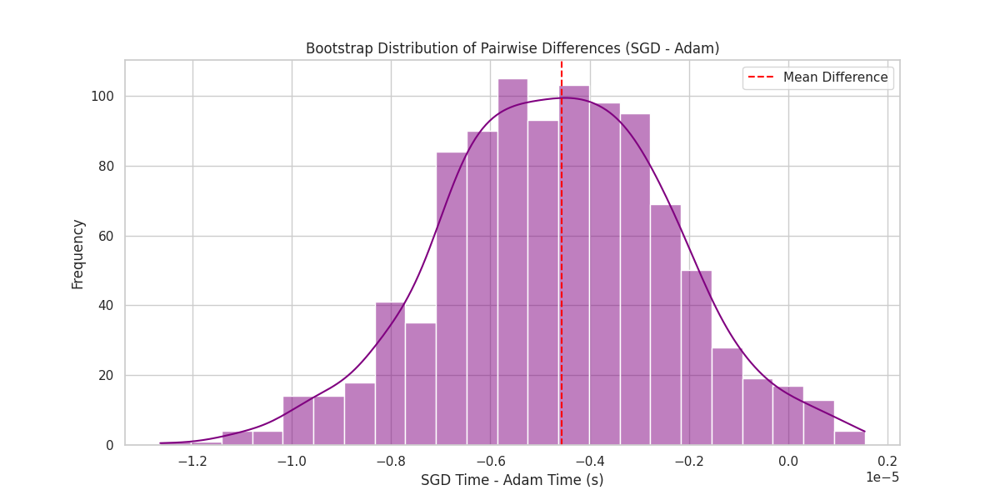
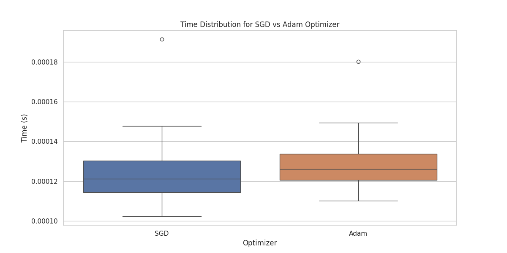
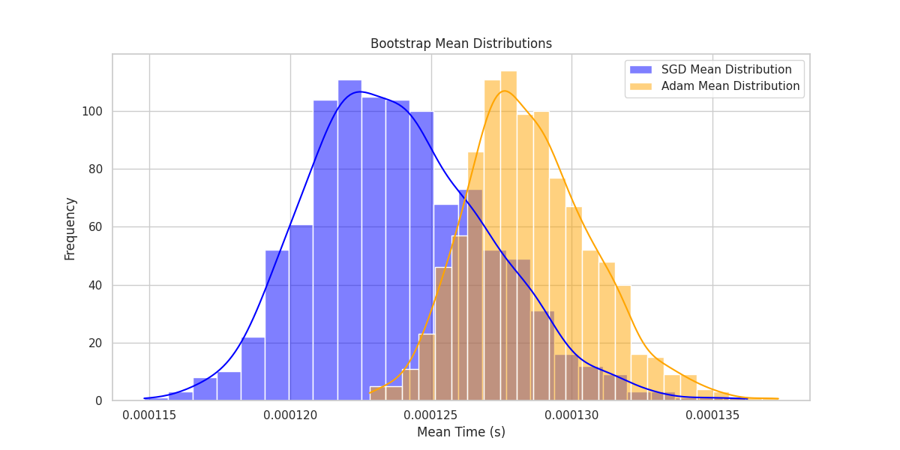

# Usage
```
cd nanoGPT

python lightning_train.py
```

# Experiment Report: Optimizer Performance Comparison for Coin Flip Prediction

## Introduction

This experiment aimed to compare the computational efficiency of two popular optimizers, Stochastic Gradient Descent (SGD) and Adam, when applied to a simple neural network model trained on a coin flip dataset. The focus was on the time taken by the `optimizer_zero_grad` operation, which resets gradients before backpropagation.

## Methodology

### Dataset and Model

- **Dataset**: A custom dataset was created (`GenerateDataset`) where each sequence represents a series of coin flips with a probability of heads set to 0.666. The dataset includes 1000 samples with each sequence having a length of 10 flips.

- **Model**: A simplified version of a transformer model (`GPT`) with nanoGPT was used. The model only contains 1 layer for fast training.

### Optimizer Comparison

- **SGD**: Known for its simplicity, SGD updates parameters based on the gradient of the loss function for each mini-batch.
- **Adam**: An adaptive learning rate method that computes individual learning rates for different parameters from estimates of the first and second moments of the gradients.

### Training Procedure

- The model was trained for one epoch using both SGD and Adam optimizers with identical learning rates.
- The time taken for the `optimizer_zero_grad` operation was measured for each optimizer over all iterations.

### Data Analysis

- **Timing Data**: The time taken by `optimizer_zero_grad` was recorded for each optimizer during training.
- **Bootstrap Resampling**: To estimate the distribution of mean times, bootstrap resampling was performed 1000 times for each optimizer's timing data.

### Visualization

- **Box Plot**: Showcased the distribution of times for each optimizer, highlighting central tendency and variability.
- **Bootstrap Distribution**: A histogram was created to visualize the distribution of mean times from bootstrap resampling, allowing for comparison between SGD and Adam.
- **Time Diff Plot**: A histogram shows the distribution of SGD time - Adam time, which allows a more strightforward way to compare the difference between SGD and Adam.

## Results
- **Time Diff Plot**: 
  
  The plot indicated that:
  - SGD takes less time than Adam, because the mean is a negative number. 

- **Box Plot**: 
  
  The box plot indicated that:
  - SGD has a slightly larger variety than Adam. 

- **Bootstrap Analysis**: 
  
  The bootstrap distributions showed:
  - The results match our conclusion from the time diff plot, which is SGD generally faster than Adam.

- **Time**
    ```
    sgd_times: [0.0001914501190185547, 0.00014781951904296875, 0.00013375282287597656, 0.00013518333435058594, 0.00011849403381347656, 0.00014066696166992188, 0.0001246929168701172, 0.00011920928955078125, 0.00011777877807617188, 0.00012993812561035156, 0.00011849403381347656, 0.0001266002655029297, 0.00011444091796875, 0.00011920928955078125, 0.0001232624053955078, 0.00013113021850585938, 0.00012969970703125, 0.0001277923583984375, 0.000125885009765625, 0.00011420249938964844, 0.00011563301086425781, 0.00011277198791503906, 0.00010418891906738281, 0.00011444091796875, 0.00011777877807617188, 0.00013685226440429688, 0.00012302398681640625, 0.0001430511474609375, 0.00010323524475097656, 0.00010228157043457031, 0.00010228157043457031, 0.000102996826171875]

    adam_times: [0.00018024444580078125, 0.00013327598571777344, 0.0001266002655029297, 0.0001327991485595703, 0.0001327991485595703, 0.00013494491577148438, 0.00013184547424316406, 0.00013518333435058594, 0.00013065338134765625, 0.00013828277587890625, 0.00012755393981933594, 0.00012993812561035156, 0.00012063980102539062, 0.00011754035949707031, 0.00013780593872070312, 0.00011754035949707031, 0.0001251697540283203, 0.00011515617370605469, 0.00012350082397460938, 0.00011134147644042969, 0.0001494884490966797, 0.00013780593872070312, 0.00012540817260742188, 0.0001251697540283203, 0.00011873245239257812, 0.00014066696166992188, 0.00011014938354492188, 0.00012254714965820312, 0.00012087821960449219, 0.00012063980102539062, 0.00012087821960449219, 0.00011920928955078125]
    ```

## Conclusion

- **SGD** proved to be faster per iteration due to its simplicity, as expected. However, its total training time might be longer if more iterations are needed for convergence.
- **Adam**, while slower per iteration, might require fewer iterations to reach a good solution due to its adaptive learning rate, potentially making it more efficient in practice.
- The variability in Adam's timing suggests that in scenarios where computational resources are limited, SGD might be preferred for its consistency, whereas Adam could be chosen for its ability to adapt learning rates for better convergence.
